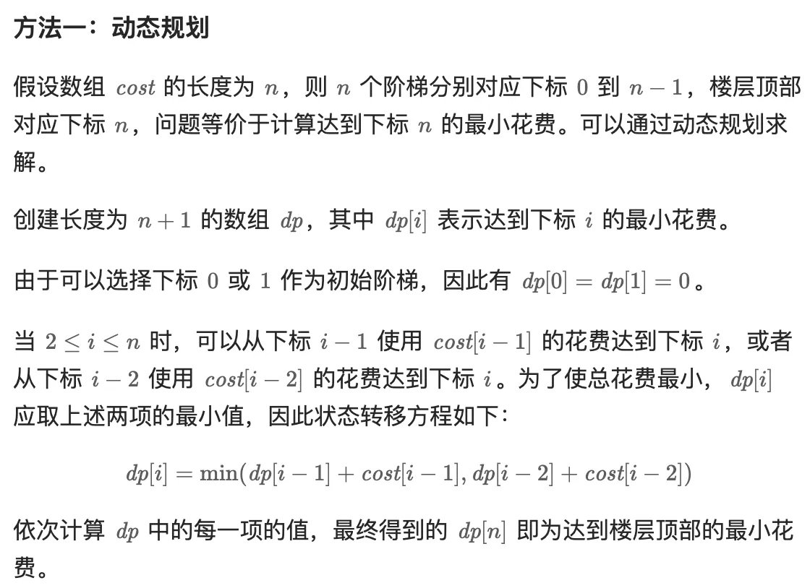
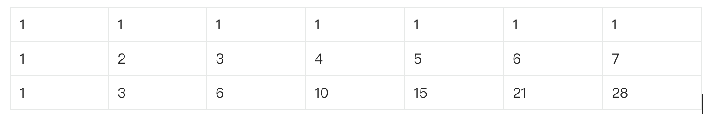

# Leetcode

## 1. 斐波那契类型

### 1.1 [爬楼梯](https://leetcode.cn/problems/climbing-stairs/?envType=study-plan-v2&envId=dynamic-programming)

> 一阶楼梯只有一种爬法，二阶楼梯有两种爬法 这可以作为初始的已知值，并且f(n) = f(n-1) +f(n-2)
```java
class Solution {
    public int climbStairs(int n) {
        int s1 = 1,s2 = 2;
        if(n == 1){
            return s1;
        }else if(n == 2){
            return s2;
        }
        int sn = 0;
        for(int i=2;i<n;i++){
            sn = s1+ s2;
            s1 = s2;
            s2 = sn;
        }
        return sn;
    }
}
```

### 1.2 [斐波那契数列](https://leetcode.cn/problems/fibonacci-number/description/?envType=study-plan-v2&envId=dynamic-programming)

>同上，相同的状态转移方程，改变下初始值就行

```java
class Solution {
    public int fib(int n) {
        int s0 = 0,s1 = 1;
        if(n == 0){
            return s0;
        }else if(n == 1){
            return s1;
        }
        int sn = 0;
        for(int i=2;i<=n;i++){
            sn = s0+ s1;
            s0 = s1;
            s1 = sn;
        }
        return sn;
    }
}
```

### 1.3 [第 N 个泰波那契数](https://leetcode.cn/problems/n-th-tribonacci-number/description/?envType=study-plan-v2&envId=dynamic-programming)

> 同样性质的给出初始值 T0 = 0, T1 = 1, T2 = 1, 且在 n >= 0 的条件下 Tn+3 = Tn + Tn+1 + Tn+2

```Java
class Solution {
    public int tribonacci(int n) {
        int s0 = 0,s1 = 1,s2=1;
        if(n == 0){
            return s0;
        }else if(n == 1 || n ==2){
            return s1;
        }
        int sn = 0;
        for(int i=3;i<=n;i++){
            sn = s0+ s1+s2;
            s0 = s1;
            s1 = s2;
            s2 = sn;
        }
        return sn;
    }
}

```

### 1.4 [使用最小花费爬楼梯](https://leetcode.cn/problems/min-cost-climbing-stairs/?envType=study-plan-v2&envId=dynamic-programming)



```Java
class Solution {
    public int minCostClimbingStairs(int[] cost) {
        int n = cost.length;
        int[] dp = new int[n+1];
        dp[0] = 0;
        dp[1] = 0;
        if(n == 2){
            return Math.min(cost[0],cost[1]);
        }
        for(int i= 2;i<=n;i++){
            dp[i] = Math.min(dp[i-1]+cost[i-1],dp[i-2]+cost[i-2]);
        }
        return dp[n];
    }
}
```

### 1.5 [打家劫舍](https://leetcode.cn/problems/house-robber/description/?envType=study-plan-v2&envId=dynamic-programming)

> 对于最后一家 下标 n只有两种结果，抢还是不抢，不抢是s[n-1] + 0 抢了是s[n-2] + nums[n]，比较二者即可

```Java
class Solution {
    public int rob(int[] nums) {
        int n = nums.length;
        if (n == 1) {
            //s1
            return nums[0];
        }
        if (n == 2) {
            //s2
            return Math.max(nums[0], nums[1]);
        }
        // sn = Math.max(s[n-1],s[n-2]+nums[n-1])
        int si=0,pre=nums[0],curr=Math.max(nums[0], nums[1]);
        for (int i = 3; i <= n; i++) {
            si = Math.max(curr,pre+nums[i-1]);
            pre = curr;
            curr = si;
        }
        return si;
    }
}
```

### 1.6 [删除并获得点数](https://leetcode.cn/problems/delete-and-earn/description/?envType=study-plan-v2&envId=dynamic-programming)

> 每个数字不管出现几次，只要拿了就应该全部拿光，这样也就可以将出现的数字去重排序，中间缺位的用0 补齐 比如[2,2,2,5,4] 可以去重排序补齐为[2,0,4,5],进而变形为[6,0,4,5]就可以按照1.5 打家劫舍中的情况进行处理，相邻的不能都取。

```Java
class Solution {
    public int deleteAndEarn(int[] nums) {
        Map<Integer, Integer> map = new TreeMap<>();

        for (int num : nums) {
            map.compute(num, new BiFunction<Integer, Integer, Integer>() {
                @Override
                public Integer apply(Integer t, Integer u) {
                    u = u == null ? 0 : u;
                    return t + u;
                }
            });
        }
        List<Integer> keyList = new ArrayList<>(map.keySet());
        int min = keyList.get(0);
        int len = keyList.get(keyList.size() - 1) - keyList.get(0);
        int[] newNums = new int[len + 1];
        for (int i = 0; i <=len ; i++) {
            newNums[i] = map.containsKey(i+min) ? map.get(i+min) : 0;
        }

        //System.out.println(map);

        if (newNums.length == 1) {
            return newNums[0];
        }
        if (newNums.length == 2) {
            return Math.max(newNums[0], newNums[1]);
        }
        int pre = newNums[0], curr = Math.max(newNums[0], newNums[1]);
        int sn = 0;
        for (int n = 3; n <= newNums.length; n++) {
            sn = Math.max(pre + newNums[n - 1], curr);
            pre = curr;
            curr = sn;
        }
        //System.out.println(sn);
        return sn;
    }
}
```

## 2. 矩阵类型

### 2.1 [不同路径](https://leetcode.cn/problems/unique-paths/description/?envType=study-plan-v2&envId=dynamic-programming)

> 坐标为 0 行的 或者0 列的可以初始化填充1 只有一种途径可以到达, 其余的位置 需要用上方的结果加上左侧的结果,以m =3 n=7 为例


```Java
class Solution {
    public int uniquePaths(int m, int n) {
        if(m<2||n<2){
            return 1;
        }
        int[][] arr = new int[m][n];
        for(int i =1;i<m;i++){
            arr[i][0] = 1;
        }
        for(int i =1;i<n;i++){
            arr[0][i] = 1;
        }
        for(int i =1;i<m;i++){
            for(int j=1;j<n;j++){
                arr[i][j] = arr[i-1][j]+arr[i][j-1];
            }
        }
        return arr[m-1][n-1];
    }
}
```

### 2.2 [最小路径和](https://leetcode.cn/problems/minimum-path-sum/description/?envType=study-plan-v2&envId=dynamic-programming)

> 还是渐进画表的方式，第一行和第一列可以直接计算出来，其他的位置要通过上方和左方的值比较后进行取最小值（状态转移方程），整体计算完后则最后一个值则是目标值。

```Java
class Solution {
    public int minPathSum(int[][] grid) {
        int m = grid.length;
        int n = grid[0].length;

        if (m == 1 && n == 1) {
            return grid[0][0];
        }

        for (int i = 1; i < n; i++) {
            grid[0][i] += grid[0][i - 1];
        }

        for (int i = 1; i < m; i++) {
            grid[i][0] += grid[i - 1][0];
        }

        for (int i = 1; i < m; i++) {
            for (int j = 1; j < n; j++) {
                grid[i][j] = Math.min(grid[i][j] + grid[i - 1][j], grid[i][j] + grid[i][j - 1]);
            }
        }

        return grid[m - 1][n - 1];

    }
}
```

### 2.3 [不同路径 II](https://leetcode.cn/problems/unique-paths-ii/description/?envType=study-plan-v2&envId=dynamic-programming)

> 如果初始位置和终点位置是障碍物 则没有路径可以从头到尾，其他情况，要先标记障碍物，之后对到达每个位置的路径可能性进行计算，计算方式是上方的位置的路径数加上左侧的路径数(状态转移方程)。

```Java
class Solution {
    public int uniquePathsWithObstacles(int[][] obstacleGrid) {
        if (obstacleGrid[0][0] == 1) {
            return 0;
        }

        int m = obstacleGrid.length;
        int n = obstacleGrid[0].length;

        if(obstacleGrid[m-1][n-1] ==1){
            return 0;
        }

        for (int i = 0; i < m; i++) {
            for (int j = 0; j < n; j++) {
                if (obstacleGrid[i][j] == 1) {
                    // 找出障碍物并标记
                    obstacleGrid[i][j] = -1;
                }
            }
        }

        obstacleGrid[0][0] = 1;
        for (int i = 0; i < m; i++) {
            for (int j = 0; j < n; j++) {
            
                if (obstacleGrid[i][j] == -1) {
                    
                } else {
                    int left = j - 1 >= 0 && obstacleGrid[i][j - 1] != -1 ? obstacleGrid[i][j - 1] : 0;
                
                    int up = i - 1 >= 0 && obstacleGrid[i - 1][j] != -1 ? obstacleGrid[i - 1][j] : 0;
                
                    if (i != 0 || j != 0) {
                        obstacleGrid[i][j] = left + up;
                    }
                }
            }
        }
        return obstacleGrid[m - 1][n - 1];
    }
}
```

### 2.4 [三角形最小路径和](https://leetcode.cn/problems/triangle/description/?envType=study-plan-v2&envId=dynamic-programming)

> 将树转化为一个在左下方的表格，从上一层到下一层，只能到达当前列和下一列。  
   2
  3 4
 6 5 7
4 1 8 3

```Java
class Solution {
    public int minimumTotal(List<List<Integer>> triangle) {
        int m = triangle.size();
        int n = m;

        if (m == 1) {
            return triangle.get(0).get(0);
        }
        if (m == 2) {
            return Math.min(triangle.get(0).get(0) + triangle.get(1).get(0),triangle.get(0).get(0) + triangle.get(1).get(1));
        }

        int[][] arr = new int[m][n];
        // m>= 3 时初始化表格
        arr[0][0] = triangle.get(0).get(0);
        for (int i = 1; i < m; i++) {
            arr[i][0] = arr[i - 1][0] + triangle.get(i).get(0);
            arr[i][i] = arr[i - 1][i - 1] + triangle.get(i).get(i);
        }

        for (int i = 2; i < m; i++) {
            for (int j = 1; j < i; j++) {
                arr[i][j] = Math.min(arr[i - 1][j], arr[i - 1][j - 1]) + triangle.get(i).get(j);
            }
        }

        int min = arr[m - 1][0];
        for (int i : arr[m - 1]) {
            min = i < min ? i : min;
        }

        return min;
    }
}
```

### 2.5 [最大正方形](https://leetcode.cn/problems/maximal-square/description/?envType=study-plan-v2&envId=dynamic-programming)


```Java
class Solution {
    public int maximalSquare(char[][] matrix) {
       int m = matrix.length;
        int n = matrix[0].length;
        if (m == 0 || n == 0) {
            return 0;
        }
        int[][] dp = new int[m][n];
        int maxSide = 0;
        for (int i = 0; i < m; i++) {
            for (int j = 0; j < n; j++) {
                if (matrix[i][j] == '1') {
                    if (i == 0 || j == 0) {
                        dp[i][j] = 1;
                    } else {
                        dp[i][j] = Math.min(Math.min(dp[i - 1][j], dp[i][j - 1]), dp[i - 1][j - 1]) + 1;
                    }
                    maxSide = Math.max(maxSide, dp[i][j]);
                }
            }
        }
        return maxSide * maxSide;
    }
}
```
